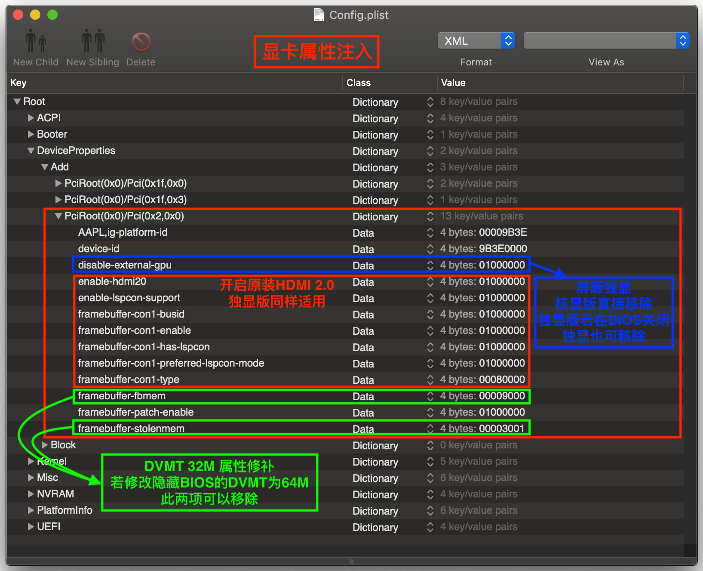
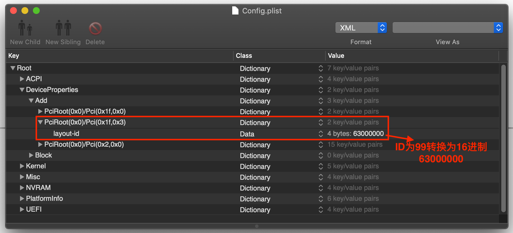
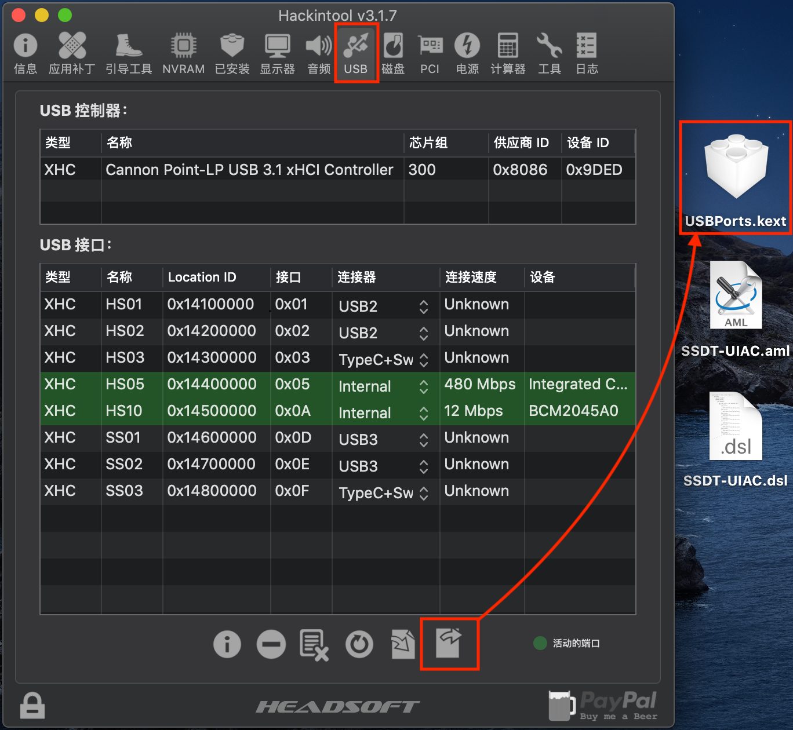
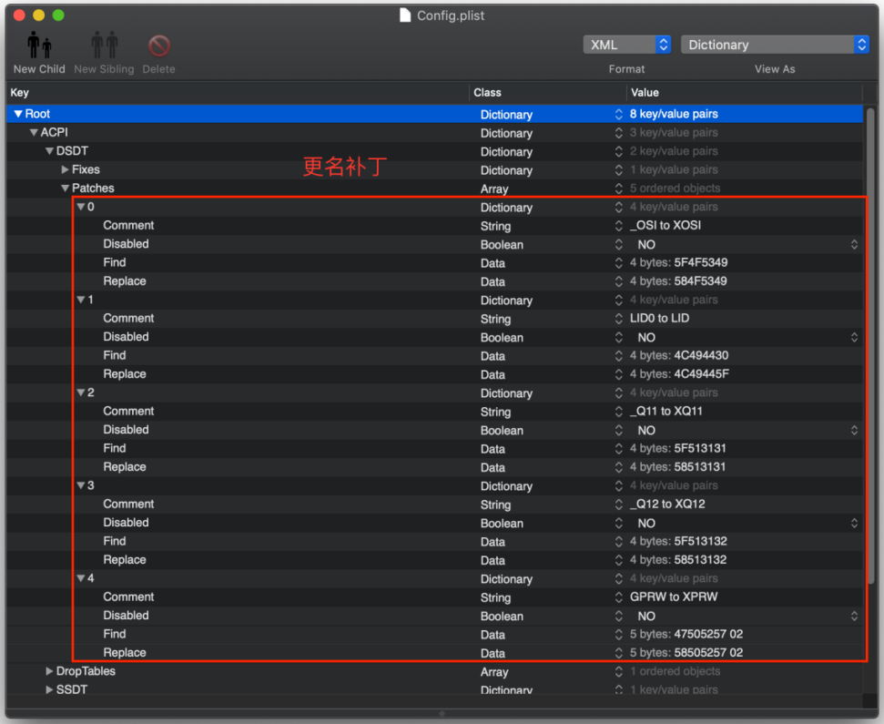
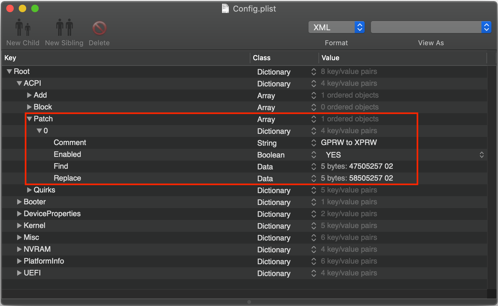

# Lenovo 小新 Air13IWL 进阶配置说明
## 联想小新Air13IWL隐藏BIOS推荐设置
- 隐藏BIOS进入姿势
  - 电源键开机 → F2进入正常BIOS → 电源键关机 → 然后顺序按下下列键
    - `F1` → `1` → `Q` → `A` → `Z`
    - `F2` → `2` → `W` → `S` → `X`
    - `F3` → `3` → `E` → `D` → `C`
    - `F4` → `4` → `R` → `F` → `V`
    - `F5` → `5` → `T` → `G` → `B`
    - `F6` → `6` → `Y` → `H` → `N`
  - 电源键开机 → F2进入隐藏BIOS , 如不成功请加快手速再次尝试
- 推荐设置选项
  - `Advanced` → `Power & Performance` → `CPU - Power Management Control` → `CPU Lock Configuration` → `CFG Lock` → `Disabled`
  - `Advanced` → `System Agent (SA) Configuration` → `Graphics Configuration` → `DVMT Pre-Allocated` → `64M`
  - `Advanced` → `PCH-IO Configuration` → `Seriallo Configuration` → `I2C1 Controller`  → `Disabled`
## 处理器 : Intel Core i5-8265U 1.60GHz Turbo 3.9Ghz 4C8T
- 驱动 : [CPUFriend.kext](https://github.com/acidanthera/CPUFriend/releases) 、[CPUFriendDataProvider.kext](https://github.com/daliansky/Lenovo-Air13-IWL-Hackintosh/tree/master/CPUFrequency)
  - [关于 CPUFriendDataProvider.kext 的定制](https://github.com/daliansky/Lenovo-Air13-IWL-Hackintosh/tree/master/CPUFrequency/ReadMe.md)
- 变频正常 , 双系统切换需要关机切换否则会有高频不降现象
## 显卡 : Intel UHD Graphics 620 Whiskey Lake-U GT2  8086:3EA0
- 驱动 : [WhateverGreen.kext](https://github.com/acidanthera/WhateverGreen/releases )
- 采用 `Properties` 方法注入 `ig-platform-id` , 默认使用 `0x3e9b0000` , 若出现睡眠唤醒花屏尝试更换 `0x3EA50009` 
- 支持亮度调节 , 支持硬解 H264 、HEVC

## 声卡 : Realtek ALC236  8086:9DC8
- 驱动 : [AppleALC.kext](https://github.com/acidanthera/AppleALC/releases) 、[CodecCommander.kext](https://bitbucket.org/RehabMan/os-x-eapd-codec-commander/downloads)
- 采用 `Properties` 方法注入 , 注入ID为`99` ( `63000000` )
- 安装 [ALCPlugFix](https://github.com/daliansky/Lenovo-Air13-IWL-Hackintosh/tree/master/ALCPlugFix) 声卡守护进程 ( 处理3.5mm接口切换 )
- 内置音频输入输出正常 , HDMI音频输出正常

## 网卡 : 更换Dell DW1820A BCM4350  14E4:43A3
- 驱动 : [AirportBrcmFixup.kext](https://github.com/acidanthera/AirportBrcmFixup/releases)
- 添加 `AirportBrcmFixup.kext` 的启动参数 `brcmfx-country=HK` , 解决5G速率限制
- 此网卡需要屏蔽5个针脚 , 如下图

## 蓝牙 : 更换Dell DW1820A BCM2045A0  0A5C:6412
- 驱动 : `BrcmFirmwareData.kext` 、`BrcmPatchRAM2.kext` 、`BrcmBluetoothInjector.kext`
## 键盘 : PS/2 标准键盘  MSFT0001
- 驱动 : [VoodooPS2Controller.kext](https://github.com/acidanthera/VoodooPS2/releases)
- Clover 移除 `VoodooPS2Controller.kext\Contents\PlugIns\VoodooPS2Mouse.kext` 、`VoodooPS2Controller.kext\Contents\PlugIns\VoodooPS2Trackpad.kext` 这两个扩展驱动 , 防止随机开机失败
## 触控板 : Intel I2C HID  INT34BB
- 驱动 : [VoodooI2C.kext 、VoodooI2CHID.kext](https://github.com/alexandred/VoodooI2C/releases)
- 屏蔽苹果原装I2C驱动 , 终端执行 `sudo kextcache -i /` 重建缓存 , 重启 , 工作正常 , 多手势正常
## USB : 端口定制 8086:9DED
- 驱动 : `XHCI-unsupported.kext` 、`USBPorts.kext`
- 使用 [Hackintool](http://headsoft.com.au/download/mac/Hackintool.zip) 定制USB , 由于指纹识别不可用所以删除对应USB端口 , 最终保留端口为:`HS01-USB2` 、` HS02-USB2` 、`HS03-USB2` 、`HS05-Internal-摄像头` 、`HS10-Internal-蓝牙` 、`SS01-USB3` 、`SS02-USB3` 、`SS03-TypeC+Sw` 其他端口都删除,导出 `USBPorts.kext` 即可

## 杂项
- ACPI
  - [HotPatch](https://github.com/daliansky/Lenovo-Air13-IWL-Hackintosh/tree/master/HotPatch)
- Drivers
  - Clover
    - 文件系统、内存驱动
      - [HfsPlus.efi 、ApfsDriverLoader.efi 、FSInject.efi 、AptioMemoryFix.efi](https://github.com/daliansky/Lenovo-Air13-IWL-Hackintosh/tree/master/EFI_Clover/CLOVER/drivers/UEFI)
    - 文件保险箱功能驱动 
      - [AppleImageCodec.efi 、AppleKeyAggregator.efi 、AppleKeyFeeder.efi 、AppleUITheme.efi 、FirmwareVolume.efi 、HashServiceFix.efi 、VirtualSmc.efi](https://github.com/daliansky/Lenovo-Air13-IWL-Hackintosh/tree/master/EFI_Clover/CLOVER/drivers/UEFI)    
  - OpenCore
    - 文件系统、内存驱动
      - [HfsPlus.efi 、ApfsDriverLoader.efi 、FwRuntimeServices.efi](https://github.com/daliansky/Lenovo-Air13-IWL-Hackintosh/tree/master/EFI_OC/OC/Drivers)
    - 文件保险箱功能驱动 
      - [VirtualSmc.efi](https://github.com/daliansky/Lenovo-Air13-IWL-Hackintosh/tree/master/EFI_OC/OC/Drivers)
- Kexts
  - 添加驱动 [NoTouchID.kext](https://github.com/al3xtjames/NoTouchID/releases) 解决输入密码卡顿问题
  - 添加必备驱动 [Lilu.kext](https://github.com/acidanthera/Lilu/releases) 
  - 添加SMC、电池、传感器驱动 [VirtualSMC.kext 、SMCBatteryManager.kext 、SMCProcessor.kext](https://github.com/acidanthera/VirtualSMC/releases)
- 所使用到的软件
  - [Hackintool](http://headsoft.com.au/download/mac/Hackintool.zip)
  - [PlistEdit Pro](https://www.fatcatsoftware.com/plisteditpro/PlistEditPro.zip)
    - Name : `TNT team`
    - Serial Number :  `PLEDPRO486-SF00-82GR-N8E3-50L2-0A0Q`
## 配置更名
- Clover 更名

- OC 更名
