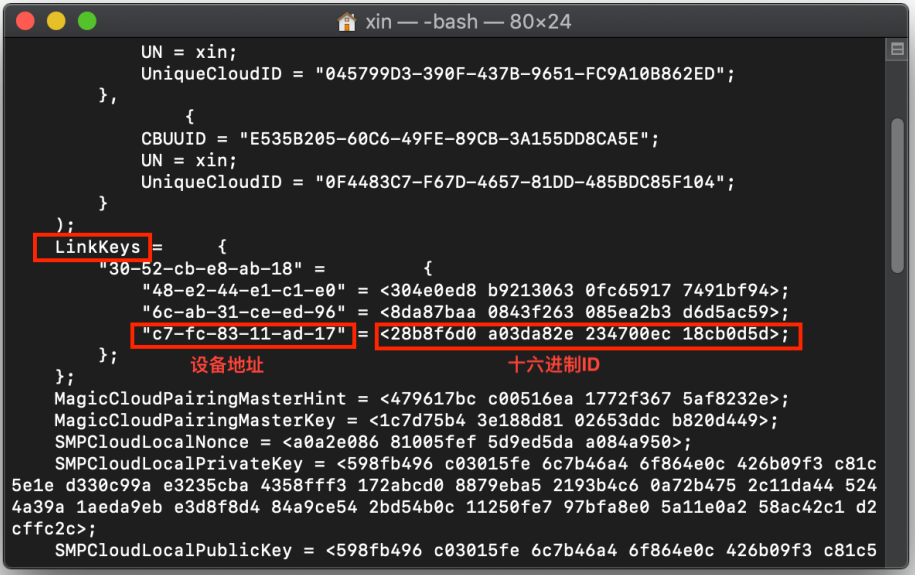
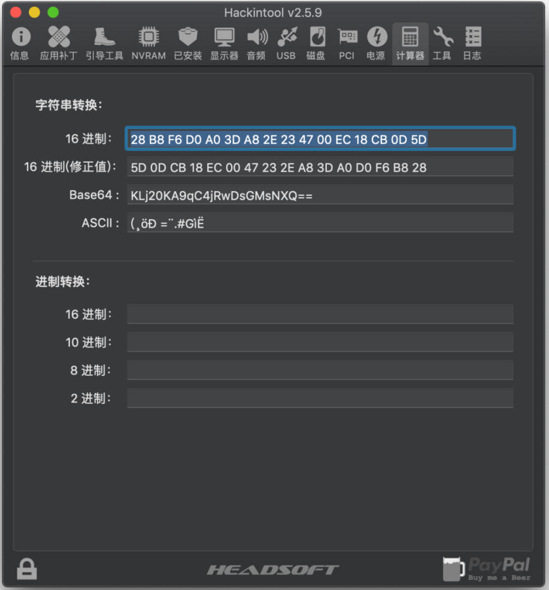
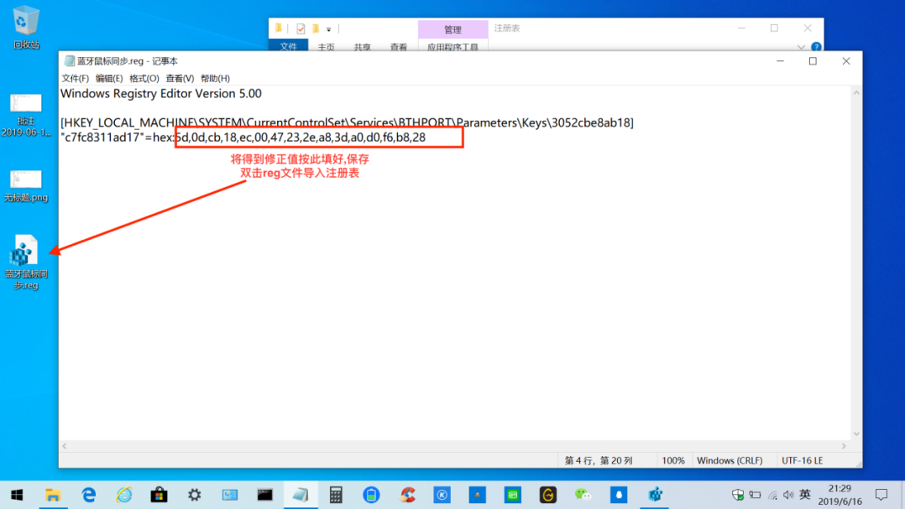

# 蓝牙设备Windows和MacOS双系统共用(xlivans)

#### 环境 :Windows 10 1903 , MacOS 10.14.5 , 以本人鼠标为例子,按顺序操作即可

+ 在Windows下配对使用成功,关机
+ 在MacOS下配对使用成功
+ 在MacOS终端执行 `sudo defaults read /var/root/Library/Preferences/com.apple.bluetoothd.plist`
+ 找到其中的`linkKeys`每个蓝牙设备对应一组十六进制ID
 
+ 按照倒序重新排列,比如
    + `28 B8 F6 D0 A0 3D A8 2E 23 47 00 EC 18 CB 0D 5D`
    + `5D 0D CB 18 EC 00 47 23 2E A8 3D A0 D0 F6 B8 28` 
+ 下面推荐个快速的方法,如图直接使用修正值即可,简单暴力!
  

+ 关机,回到Windows打开注册表,定位至[HKEY_LOCAL_MACHINE\SYSTEM\CurrentControlSet\Services\BTHPORT\Parameters\Keys]

 
+ 用记事本打开导出的.reg注册表文件,将修正后的linkKeys按下图填好,保存,双击.reg倒入注册表即可
 
+ 关闭蓝牙,打开蓝牙,至此双系统蓝牙鼠标共用完成.