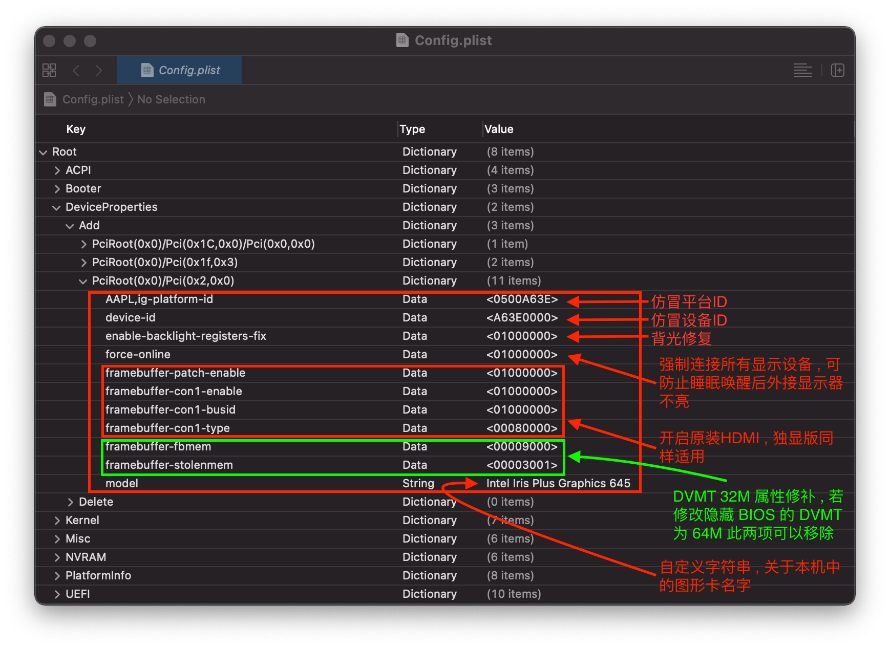
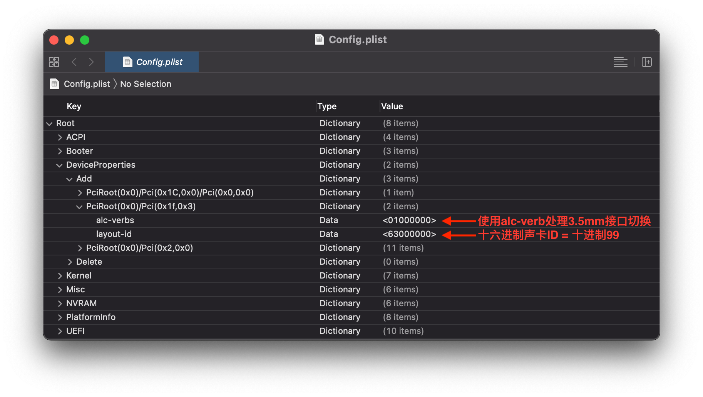
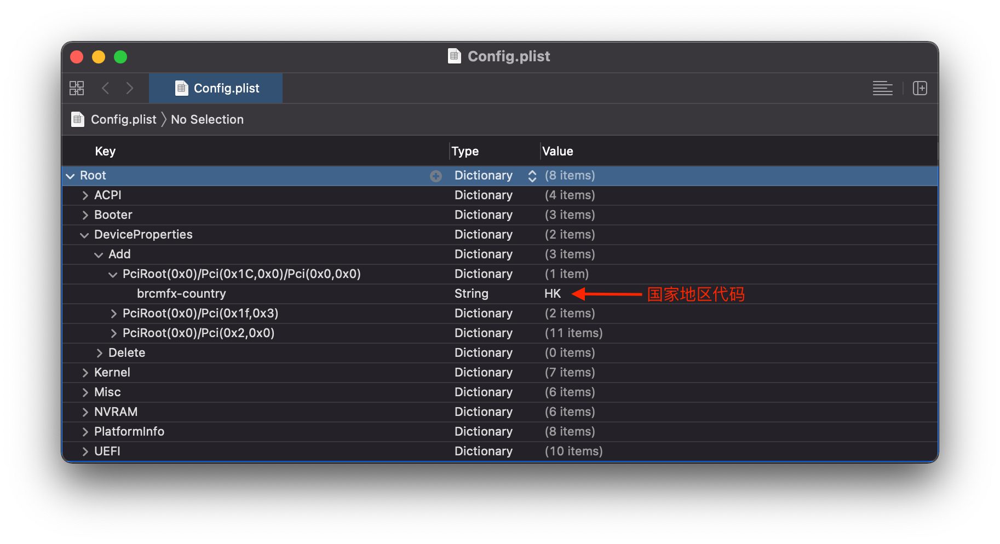
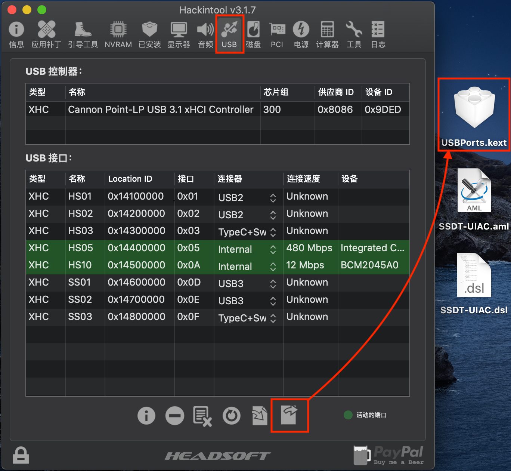

# Lenovo 小新 Air13IWL 配置信息

## 处理器 : Intel Core i5-8265U 1.60GHz Turbo 3.9Ghz 4C8T
- [调整 CPU 基础频率使其更接近`MacBookPro15,4`的CPU参数](BIOSConfig.md) , 变频正常 , 各项功能正常
## 显卡 : Intel UHD Graphics 620 Whiskey Lake-U GT3  8086:3EA0
- 驱动 : [WhateverGreen.kext](https://github.com/acidanthera/WhateverGreen/releases )

- PCI 路径: `PciRoot(0x0)/Pci(0x2,0x0)`  , 使用 `DeviceProperties` 方法仿冒 `device-id` : `3EA6` , 注入 `ig-platform-id` , 默认使用 `3EA60005`

  若使用10.13 , 10.14 系统更换机型`MacBookPro15,2`并设置 `device-id` : `3EA5` , `ig-platform-id` : `3EA50005`

- 背光正常 , 亮度调节正常 , HDMI 外接正常, Type-C 外接 DP 正常 , 支持硬解 H264 、HEVC , 各项功能正常

## 声卡 : Realtek ALC236  8086:9DC8
- 驱动 : [AppleALC.kext](https://github.com/acidanthera/AppleALC/releases)
- PCI 路径: `PciRoot(0x0)/Pci(0x1f,0x3)`  , 使用 `DeviceProperties` 方法注入 , 注入ID为`99` ( `63000000` )
- 安装 [ALCPlugFix](Tools/ReadMe.md) 声卡守护进程 ( 处理3.5mm接口切换 )
- 内置音频输入输出正常 , HDMI音频输出正常

## 网卡 : 更换为苹果拆机卡 BCM94360CS2 / BCM943602CS (使用软排线转接)
- 驱动 : [AirportBrcmFixup.kext](https://github.com/acidanthera/AirportBrcmFixup/releases)

- PCI 路径: `PciRoot(0x0)/Pci(0x1C,0x0)/Pci(0x0,0x0)`  , 使用 `DeviceProperties` 方法 , 注入国家地区代码 `#a` , 解决5G速率限制

  
## 蓝牙 : 更换为苹果拆机卡 BCM94360CS2 / BCM943602CS 免驱蓝牙
- 连续互通完美使用
## 键盘 : PS/2 标准键盘  MSFT0001
- 驱动 : [VoodooPS2Controller.kext  、VoodooPS2Keyboard.kext](https://github.com/acidanthera/VoodooPS2/releases)

- 可选驱动 : [BrightnessKeys.kext](https://github.com/acidanthera/BrightnessKeys/releases) 亮度快捷键驱动 , 也可以使用按键映射使亮度快捷键工作

- 联想小新 Air13IWL PS2 键盘功能键按键映射 , 在 Air13IWL 的 ACPI 中当 OSYS = 03E8 时默认使用以上布局 , 这里的 03E8 代表了部分版本的 Linux 和所有不能被识别的操作系统 , 部分按键映射要求不能使用操作系统补丁和影响工作状态的相关更名 , 使用方法参考 [OC-little](https://github.com/daliansky/OC-little/blob/master/07-PS2键盘映射%40OC-xlivans/README.md) , 根据此表做好的适合 Air13IWL 的补丁参考 [SSDT-RMCF](HotPatch/SSDT-RMCF.dsl)

  | 功能按键 | PS2 码    | ADB 码  | PS2 to ADB 映射 | PS2 to PS2 映射 | 说明                     |
  | -------- | --------- | ------- | --------------- | --------------- | ------------------------ |
  | Fn + F1  | e020      | 4a      | -               | -               | 默认静音键               |
  | Fn + F2  | e02e      | 49      | -               | -               | 默认音量减               |
  | Fn + F3  | e030      | 48      | -               | -               | 默认音量加               |
  | Fn + F4  | e04e      | 71      | e04e=80         | -               | 映射为 80 屏蔽多余亮度加 |
  | Fn + F5  | 3f        | 60      | -               | -               | 默认 F5 无 Fn 功能       |
  | Fn + F6  | 无反馈    | 无反馈  | 无交集无法映射  | 无交集无法映射  | 默认触摸板开关键         |
  | Fn + F7  | e003      | 80      | -               | -               | 默认屏蔽                 |
  | Fn + F8  | 无反馈    | 无反馈  | 无交集无法映射  | 无交集无法映射  | 默认无操作               |
  | Fn + F9  | e05b + 26 | 37 + 25 | 组合键无法映射  | 组合键无法映射  | 默认 Win + L 键          |
  | Fn + F10 | 无反馈    | 无反馈  | 无交集无法映射  | 无交集无法映射  | 默认无操作               |
  | Fn + F11 | e04c      | 80      | e04c=6b         | -               | 映射为亮度减             |
  | Fn + F12 | e054      | 80      | e054=71         | -               | 映射为亮度加             |
  | PrtSc    | e037=0    | 80      | 无法映射        | e037=e05e       | 映射为系统电源键         |
  | Insert   | e052      | 92      | -               | -               | 默认 Enject 键           |
  | Fn + K   | 46        | 6b      | 46=80           | -               | 映射为 80 屏蔽多余亮度减 |
  | Fn + P   | e045      | 71      | e045=80         | -               | 映射为 80 屏蔽多余亮度加 |
## 触控板 : Intel I2C HID  INT34BB
- 驱动 : [VoodooI2C.kext 、VoodooGPIO.kext 、VoodooI2CServices.kext 、VoodooInput.kext 、VoodooI2CHID.kext](https://github.com/VoodooI2C/VoodooI2C/releases)
## USB : 端口定制 8086:9DED
- 驱动 : [USBPorts.kext](https://github.com/daliansky/Lenovo-Air13-IWL-Hackintosh/tree/master/EFI/OC/Kexts)

- 使用 [Hackintool](https://github.com/headkaze/Hackintool/releases) 定制USB , 由于指纹识别不可用所以删除对应USB端口 , 最终保留端口如下:

  | 名称 | 连接器   | 设备                                   |
  | ---- | -------- | -------------------------------------- |
  | HS01 | USB2     | 电源接口附近的 USB2 端口               |
  | HS02 | USB2     | HDMI 接口附近的 USB2 端口              |
  | HS03 | TypeC+Sw | 针孔式一键恢复按钮附近的 Type - C 端口 |
  | HS05 | Internal | 内置摄像头                             |
  | HS10 | Internal | 内置蓝牙                               |
  | SS01 | USB3     | 电源接口附近的 USB3 端口               |
  | SS02 | USB3     | HDMI 接口附近的 USB3 端口              |
  | SS03 | TypeC+Sw | 针孔式一键恢复按钮附近的 Type - C 端口 |

## 杂项
- ACPI
  - [HotPatch](HotPatch)
- Kexts
  - 添加必备驱动 [Lilu.kext](https://github.com/acidanthera/Lilu/releases) 
  - 添加SMC、电池、传感器驱动 [VirtualSMC.kext 、SMCBatteryManager.kext 、SMCProcessor.kext](https://github.com/acidanthera/VirtualSMC/releases)
  - 添加可选驱动 [NVMeFix.kext](https://github.com/acidanthera/NVMeFix/releases) 优化 NVMe 硬盘的使用
- 所使用到的软件
  - [Hackintool](https://github.com/headkaze/Hackintool/releases)
  - [Xcode](https://apps.apple.com/cn/app/xcode/id497799835?mt=12)

## OpenCore 菜单

- 怎么隐藏菜单 ？

  - Config.plist - Misc - Boot
    - `ShowPicker		Boolean		NO`

- 单 ESP 分区菜单看不到 Windows 怎么办 ？

  - Config.plist - Misc - Security
    - `ScanPolicy		Number		0`  ( 自定义必须包含 ESP )
  - Config.plist - Misc
    - BlessOverride  ( 覆盖替换掉 Windows 的 BOOTx64.efi 情况下, 需要在此指定 Windows 引导 )
      - `Item0		<String>	\EFI\Microsoft\Boot\bootmgfw.efi`

- 怎么临时开启 -V 模式 ？

  - Config.plist - Misc - Boot
    - `PollAppleHotKeys		Boolean		YES` 
  - 对小新 Air13IWL 来说 , 开机前按住 ESC 键 , 显示菜单后按下 CMD + V 然后选择 MacOS 即可

- 怎么让 MacOS 成为 OC 默认引导系统 ？

  - 方法1 : OC 0.5.4 版本之后打开下列开关 , 在引导菜单使用 Ctrl + Index 或 Ctrl + Enter 设置默认项
    - Config.plist - Misc - Security
      - `AllowSetDefault		Boolean		YES`

  + 方法2 : 对于支持原生 NVRAM 机型 , 在 `系统偏好设置 - 启动磁盘` 选择对应的卷宗重启即可

## OpenCore 启动磁盘 切换系统的使用

- 使用环境 
  - Windows 10 和 Catalina 单硬盘双系统
  - MacOS 下的 Windows 系统分区为挂载状态
  - 使用 OC 做主引导 , 双系统共用单 ESP 分区 
  - 使用 OC 引导启动 Windows 10 安装苹果官方的 BootCamp
    - MacOS下打开 APP **启动转换助理** , `菜单栏 - 操作 - 下载 Windows 支持软件` 按提示操作即可下载最新 Windows 版支持软件 , 其中包含 BootCamp
- Config.plist 
  - Misc
    - BlessOverride  ( 覆盖替换掉 Windows 的 BOOTx64.efi 情况下, 需要在此指定 Windows 引导 )
      - `Item0		<String>	\EFI\Microsoft\Boot\bootmgfw.efi`
    - Security
      - `ExposeSensitiveData		<Number>	2 `
      - `ScanPolicy		<Number>	525571 `   ( 自定义必须包含 ESP , 例 : NVME + APFS + ESP )
  - UEFI
    - Quirks
      - `RequestBootVarRouting		<Boolean>		YES`
