# Lenovo-Air13-IWL
联想小新Air 13 IWL笔记本EFI

## 电脑配置

| 规格     | 详细信息                                                     |
| -------- | ------------------------------------------------------------ |
| 电脑型号 | 联想Lenovo Air 13 IWL笔记本电脑                              |
| 操作系统 | macOS Mojave 18A389/macOS High Sierra 10.13.6 17G2208        |
| 处理器   | Intel(R) Core(TM) i7-8565U CPU @ 1.80GHz                     |
| 内存     | 16 GB  1867MHz                                               |
| 硬盘     | Crucial_CT500MX200SSD1 (500G固态)                            |
| 显卡     | 英特尔 HD Graphics 500 8086:3EA0(Whiskey Lake) (显卡仿冒：注入platform-id:0x3e9b0009) |
| 显示器   | FHD 1920x1080 (13.3 英寸)                                    |
| 声卡     | ALC236 (layout-id:2)                                         |
| 网卡     | REALTEK 10EC:B822 已更换为Bcm94352z(14E4:43B1)               |

## 安装镜像

直接使用博客中的镜像进行安装：[【黑果小兵】macOS Mojave 10.14(18A389) with Clover 4670原版镜像](https://blog.daliansky.net/macOS-Mojave-10.14-18A389-Release-with-Clover-4670-original-mirror.html)

## 完善驱动

1. 声卡：型号为ALC236，注入ID：2，使用AppleALC仿冒，顺利加载；修正HDMI Audio输出信息；
2. 网卡：REALTEK 10EC:B822的无线网卡截止到目前还是无解，更换为DW1560/DW1830；
3. 显卡：Intel HD Graphics 500，Whiskey Lake平台目前还没有驱动程序，使用Coffee Lake仿冒驱动，Platform-id为：0x3e9b0009，添加DVMT补丁；采用Devices-Properties方法注入；核显版外接HDMI显示器工作正常；睡眠唤醒正常；
4. 蓝牙工作正常；睡眠唤醒工作正常；
5. 电池信息正常；
6. 触摸板：使用`VoodooI2C`驱动，多手势全功能正常工作；
7. 显示器亮度调节正常；亮度调节快捷键：`F11`和`F12`
8. USB端口采用SSDT-UIAC.aml进行修改；摄像头、读卡器已内建，避免睡眠问题；

## 系统截图

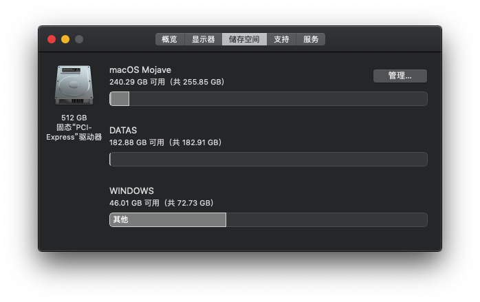

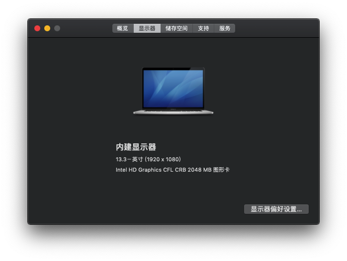

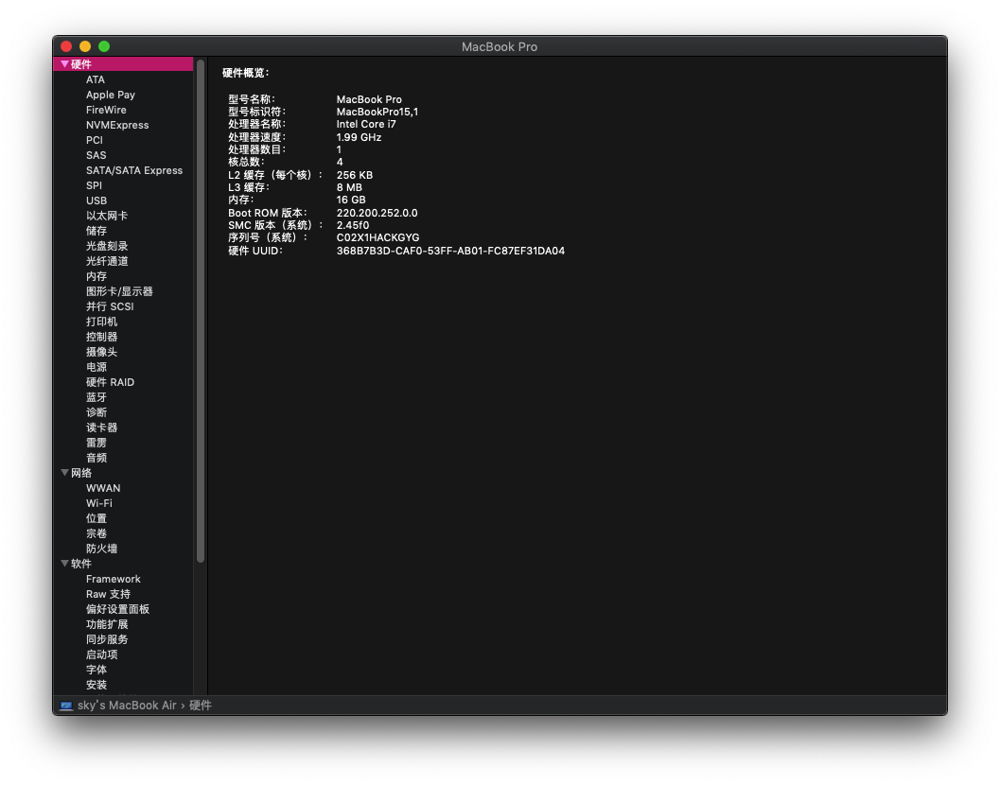

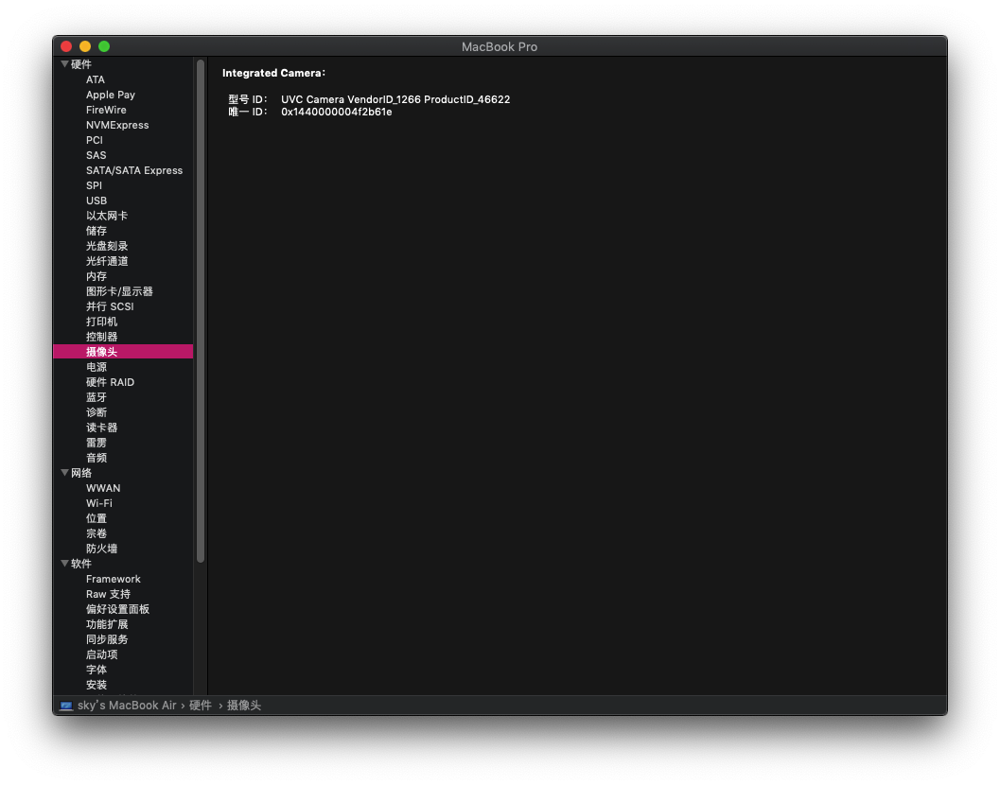

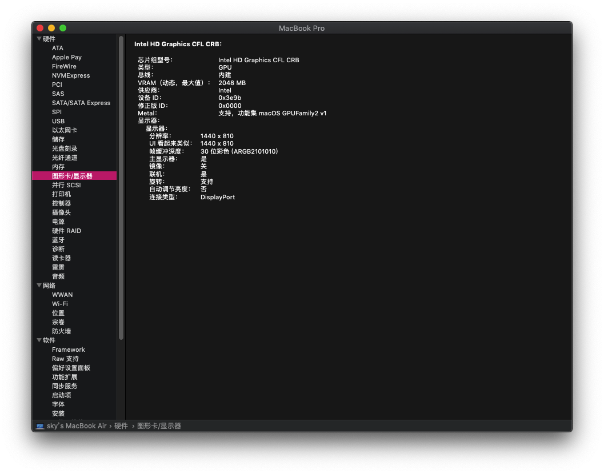

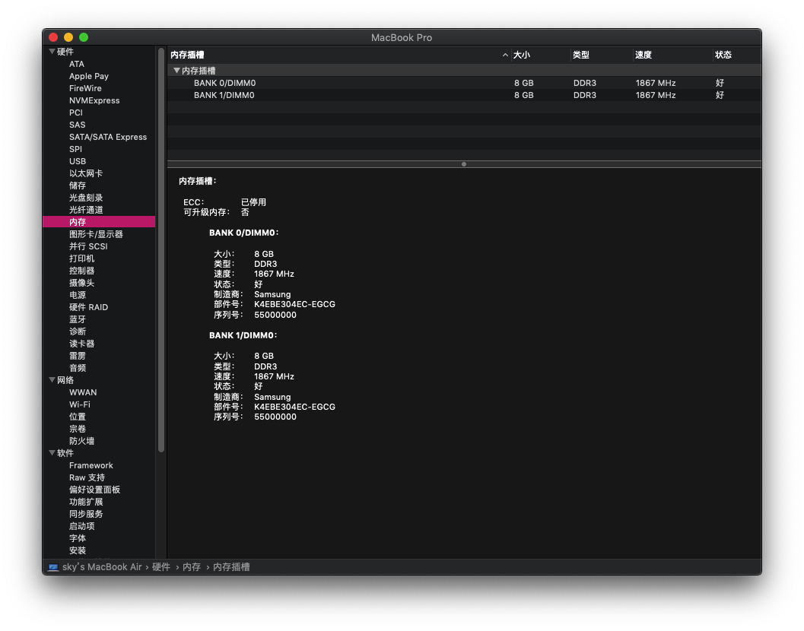

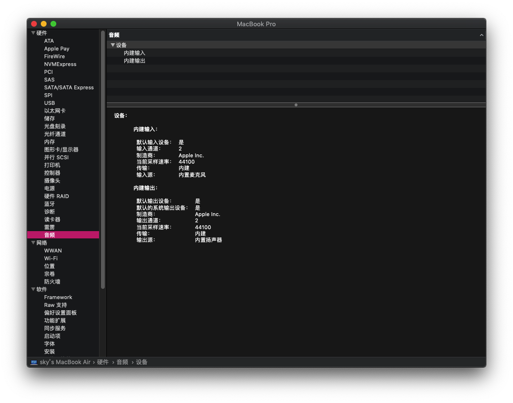

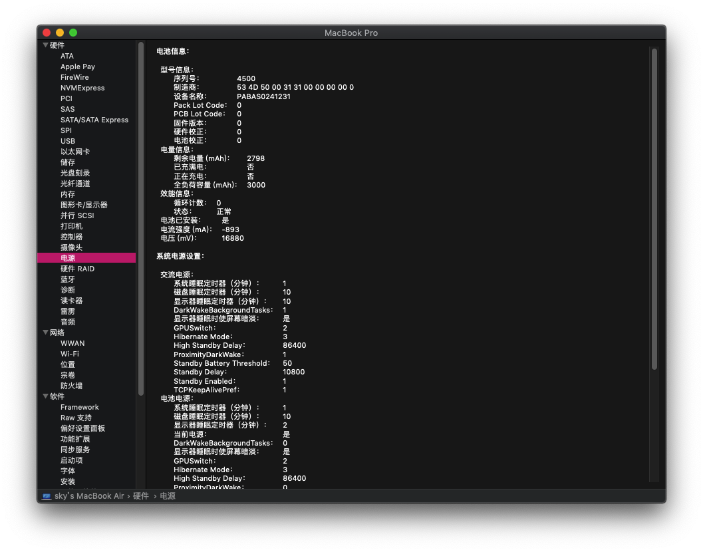

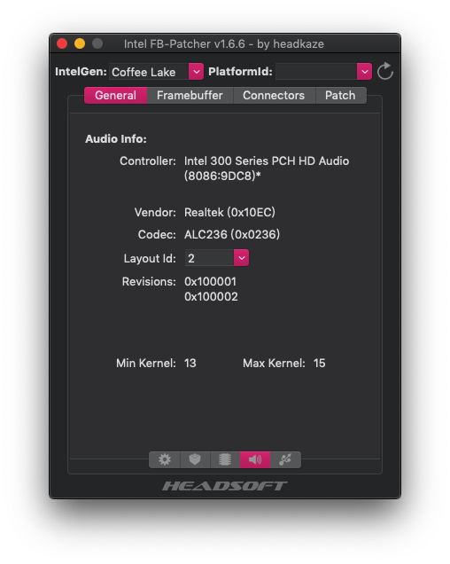

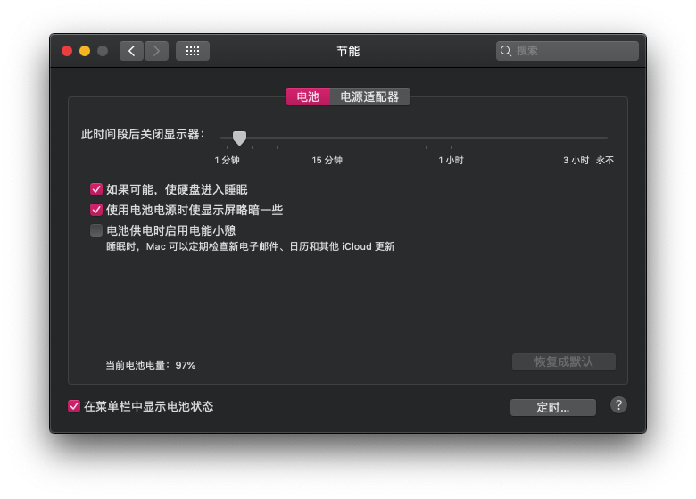

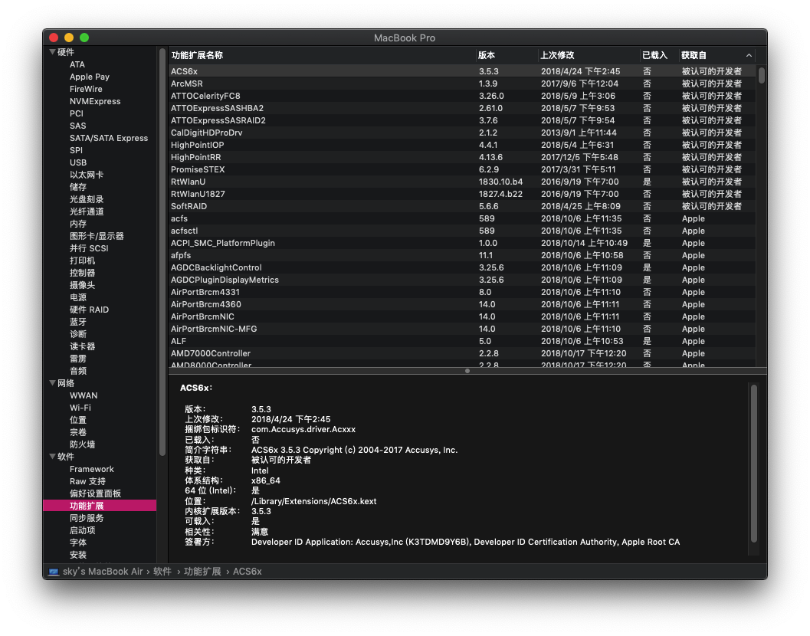

## 更新日志：

- 11-25-2018
  - 修改显卡驱动方式：
    - Whiskey lake仿冒Coffee lake
    - platform-id注入id:`3e9b0006`
    - 可完美睡眠唤醒，可调节屏幕亮度
  - 声卡驱动方式：
    - 采用`AppleALC`仿冒原生驱动`AppleHDA`
    - ALC236注入id:2
    - 驱动方式：`FakePCI-ID`+`FakePCIID_Intel_HDMI_Audio`
  - 添加`ALCPlugFix`守护进程，解决耳机/耳麦自动切换，解决睡眠唤醒

## EFI下载链接：

Https://github.com/daliansky/Lenovo-Air13-IWL

