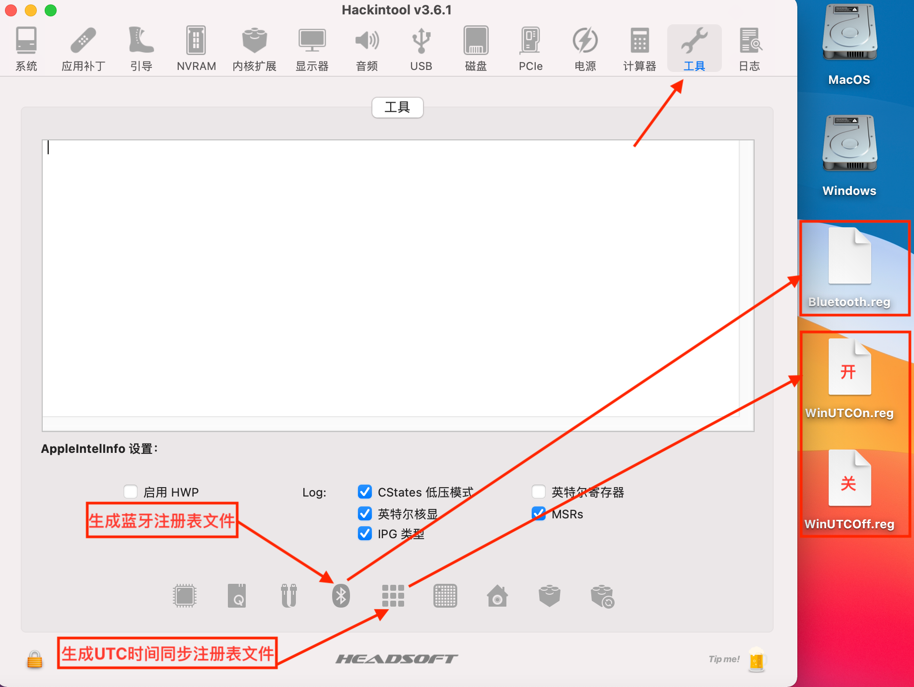

# Tools

- **[Air13IWL-ALCPlugFix.sh](Air13IWL-ALCPlugFix.sh) : 安装 [ALCPlugFix](ALCPlugFix) 和 [alc-verb](alc-verb) 来修复 3.5 mm 耳麦切换异常问题**
  
  - [ALCPlugFix](ALCPlugFix) : 守护进程 , 在开机和睡眠唤醒后通过执行 `alc-verb 0x19 SET_PIN_WIDGET_CONTROL 0x25` 让 Air13IWL 的 3.5 mm 耳麦正常工作
  - [alc-verb](alc-verb) : HD-Audio 命令发送程序 ,  [alc-verb](alc-verb) 依赖于 **[AppleALC](https://github.com/acidanthera/AppleALC) 1.5.4** 之后的版本 
  
- **[Air13IWL-HiDPI.sh](Air13IWL-HiDPI.sh) : 开启 HiDPI 提升系统 UI 质量**
  
  - 适用于 macOS 10.15 和 macOS 11 , HiDPI 默认 (1600x900 , 1440x810 , 1280x720)
  
- **[hidpi-zh.sh](hidpi-zh.sh) : 开启 HiDPI 提升系统 UI 质量**
  
  - 适用于 macOS 10.14 或更早的版本 , 自定义 HiDPI
  - [Icons.plist](Icons.plist) : 定义 `统便好设置 - 显示器` 的图标
  
- **Windows 和 MacOS 蓝牙设备双系统共用和时间同步**

  - 蓝牙设备首先在 Windows 下配对使用成功 , 然后在 MacOS 下配对使用成功

  - 在 MacOS 下使用软件 [Hackintool](Hackintool.zip) 中的工具可以方便的向桌面导出 Windows 可使用的注册表文件

    

  - 回到 Windows 双击得到的注册表文件 , 导入即可

